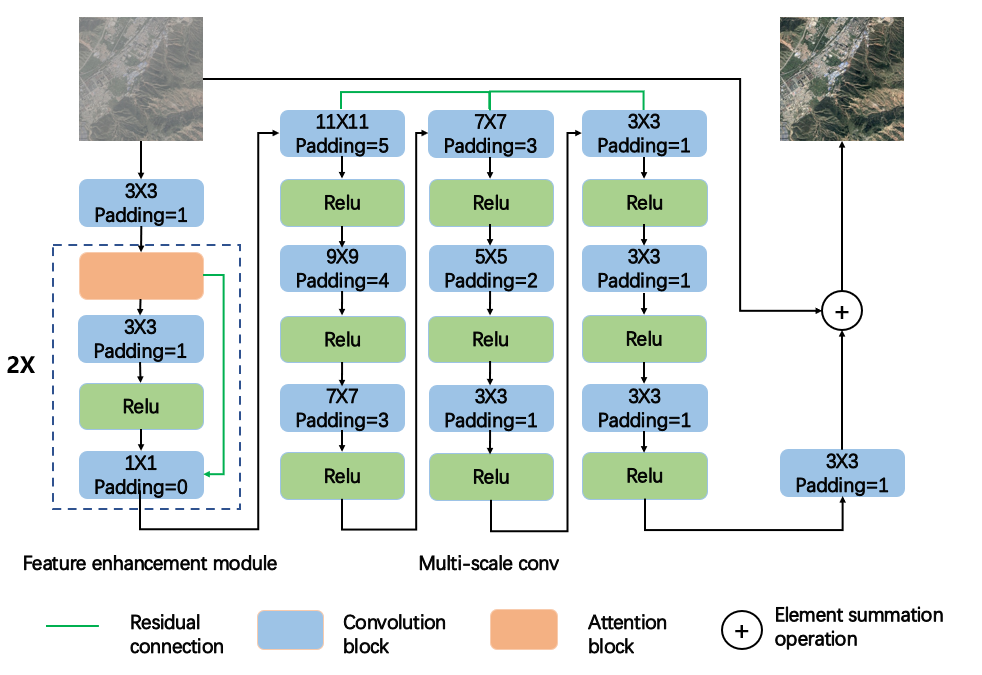

# PM-LSMN
Code of Lightweight thin cloud removal model

## Running environment:
python=3.6, pytorch-gpu=1.10.2,opencv-python=4.40,wandb=0.13.1,tqdm=4.46

## Architecture of PM-LSMN


## To train: 
```bash
  python train.py 
```

## To test: 
```bash
  python evaluation.py 
```

**dataset:** We trained and tested our proposed PM-LSMN model on two datasets, RICE1 and T-cloud, respectively. The RICE1 dataset is derived from Google Earth and consists of 500 pairs of thin and cloudless images of a size of 512 x 512. Of these, 400 were used for training and the remaining 100 for testing. The T-cloud dataset is derived from Landsat 8 RGB images. The dataset contains 2939 pairs of 256 x 256 cloud and no cloud images, where 4⁄5 is set as the training set and 1⁄5 is set as the test set.
- RICE1 dataset
```bash
 https://github.com/BUPTLdy/RICE_DATASET
```
- T-cloud dataset
```bash
 https://github.com/haidong-Ding/Cloud-Removal
```
